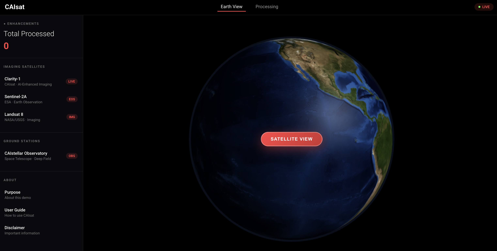

<!--
Title: AI-Powered Satellite Imagery Enhancement
Description: Deploy AI-powered resolution enhancement for satellite imagery using OpenShift AI on Red Hat OpenShift.
Industry: Earth Observation, Agriculture, Urban Planning
Product: Red Hat OpenShift AI
Use case: Satellite Image Processing
-->

# AI-Powered Satellite Imagery Enhancement

Deploy AI-powered resolution enhancement for satellite imagery using OpenShift AI on Red Hat OpenShift.



---

## Table of Contents

- [Overview](#overview)
- [Architecture](#architecture)
- [Requirements](#requirements)
- [Deploy](#deploy)
  - [Prerequisites](#prerequisites)
  - [Installation](#installation)
  - [Validation](#validation)
  - [Deletion](#deletion)
- [How It Works](#how-it-works)
- [Use Cases](#use-cases)
- [References](#references)

---

## Overview

Welcome to CAIsat, where you can gaze upon our beautiful Earth from space and enhance satellite imagery with the power of AI. This application lets users explore a 3D rotating globe, navigate live satellite maps, and capture regions to enhance from 256×256 to 512×512 resolution using the SwinIR deep learning model running on Red Hat OpenShift AI.

---

## Architecture

```
┌─────────────────────────────────────────────────────────────────┐
│  Frontend (React)                                               │
│  • Three.js 3D rotating Earth                                  │
│  • Leaflet satellite map (Esri World Imagery)                  │
│  • Drag-and-drop selection box (256×256 region)                │
│  • Mouse wheel zoom for detail inspection                      │
│  • Before/after comparison view                                │
└──────┬──────────────────────────────────────────────────────────┘
       │ REST API
       ▼
┌─────────────────────────────────────────────────────────────────┐
│  Backend (FastAPI + Python)                                     │
│  • Crop 256×256 region based on selection                      │
│  • Convert to normalized tensor format                         │
│  • Track enhancement statistics                                │
└──────┬──────────────────────────────────────────────────────────┘
       │ KServe v2 Protocol
       ▼
┌─────────────────────────────────────────────────────────────────┐
│  OpenShift AI - Model Serving                                   │
│  ┌───────────────────────────────────────────────────────────┐ │
│  │  MLServer Runtime (ONNX Backend)                          │ │
│  │  ┌─────────────────────────────────────────────────────┐ │ │
│  │  │  Model                                              │ │ │
│  │  └─────────────────────────────────────────────────────┘ │ │
│  └───────────────────────────────────────────────────────────┘ │
└──────┬──────────────────────────────────────────────────────────┘
       │
       ▼
┌─────────────────────────────────────────────────────────────────┐
│  Enhanced Image Display                                         │
│  • Receive 512×512 enhanced image                              │
│  • Display side-by-side with original                          │
│  • Download enhanced result                                    │
└─────────────────────────────────────────────────────────────────┘
```

The application consists of three containerized components deployed on OpenShift:

1. **Frontend (React)**: 3D Earth globe, interactive satellite map, drag-and-drop selection box, and zoom controls
2. **Backend (FastAPI)**: Image preprocessing, crop extraction, tensor conversion, and KServe communication
3. **Model Server (OpenShift AI)**: SwinIR ONNX model served via MLServer with KServe v2 protocol for 2× resolution enhancement

Activate satellite view to browse satelite imagery, capture a screenshot, select a 256×256 region of interest, and watch as the AI model upscales it to 512×512 with enhanced detail.

---

## Requirements

### Hardware

- **CPU**: 5 cores minimum
  - Frontend: 50 millicores request, 200 millicores limit
  - Backend: 100 millicores request, 500 millicores limit
  - Model Server: 4 cores request, 4 cores limit
- **Memory**: 9 GiB minimum
  - Frontend: 128 MiB request, 256 MiB limit
  - Backend: 256 MiB request, 512 MiB limit
  - Model Server: 6 GiB request, 8 GiB limit
- **GPU**: Not required (CPU-only inference supported, ~5-10 seconds per image)

### User Permissions

- Ability to create projects/namespaces
- Ability to deploy workloads (Deployments, Services, Routes)
- Ability to create InferenceService resources (for OpenShift AI model serving)
- Ability to create ServingRuntime resources

---

## Deploy

### Prerequisites

1. **Red Hat OpenShift cluster** 
2. **OpenShift AI Operator installed** with KServe/ModelMesh enabled
3. **oc CLI** authenticated to your cluster
4. **Helm 3.10+** installed locally

### Installation

1. **Clone this repository**:
   ```bash
   git clone https://github.com/rh-ai-quickstart/caisat.git
   cd caisat
   ```

2. **Create a namespace**:
   ```bash
   oc new-project caisat
   ```

3. **Deploy the application using Helm**:
   ```bash
   helm install caisat ./chart \
     --namespace caisat \
     --set model.deploy=true
   ```

4. **Wait for all pods to be ready** (this may take 2-3 minutes):
   ```bash
   oc get pods -n caisat -w
   ```

5. **Get the application URL**:
   ```bash
   oc get route caisat-frontend -n caisat -o jsonpath='{.spec.host}'
   ```

### Validation

1. **Check that all pods are running**:
   ```bash
   oc get pods -n caisat
   ```
   
   Expected output showing 3 running pods:
   ```
   NAME                                    READY   STATUS    RESTARTS   AGE
   caisat-backend-xxxxxxxxx-xxxxx          1/1     Running   0          2m
   caisat-frontend-xxxxxxxxx-xxxxx         1/1     Running   0          2m
   swinir-predictor-xxxxxxxxx-xxxxx        2/2     Running   0          2m
   ```

2. **Verify the model server is ready**:
   ```bash
   oc get inferenceservice -n caisat
   ```
   
   The `READY` column should show `True`.

3. **Access the application**:
   - Open the route URL from step 5 of Installation in your web browser
   - You should see the CAIsat interface with a rotating 3D Earth
   - Click "Satellite View" to access the live satellite map
   - Navigate to any location, click "Capture & Enhance"
   - Drag the red 256×256 box over your region of interest
   - Click "Enhance Selected Area"
   - The enhanced image should appear within 5-10 seconds

### Deletion

To completely remove the application:

```bash
helm uninstall caisat -n caisat
oc delete project caisat
```

---

## How It Works

1. **Activate**: Click "Satellite View" to switch to interactive Esri satellite imagery
2. **Navigate**: Pan and zoom to find your area of interest (cities, coastlines, forests, etc.)
3. **Capture**: Click "Capture & Enhance" to take a screenshot of the current map view
4. **Select**: Drag the red 256×256 selection box over your target region
   - Use scroll wheel to zoom in for precision
   - Position the box exactly where you want enhancement
5. **Enhance**: Click "Enhance Selected Area"
   - Backend extracts the selected 256×256 region
   - Image is converted to a normalized tensor
   - SwinIR model processes it to 512×512 (2× upscaling)
6. **Compare**: View before and after side-by-side to see recovered details
7. **Download**: Save the enhanced 512×512 image for your records

Processing time: ~5-10 seconds per image on CPU.

---

## Use Cases

### Agriculture & Crop Monitoring
Enhance satellite imagery of agricultural fields to detect crop stress, improve field boundary detection, and analyze historical low-resolution archives. Useful for precision agriculture applications where high-resolution imagery is cost-prohibitive or unavailable.

### Urban Planning & Development
Improve resolution of building and infrastructure details for development zone analysis, historical change detection, and city planning. Enhance archival imagery to understand urban growth patterns over time.

### Environmental Monitoring
Apply AI upscaling to coastal observation, forest canopy analysis, wildlife habitat mapping, and ecosystem change detection. Enhance imagery from areas where frequent high-resolution coverage is unavailable.

### Disaster Response & Assessment
Enhance damage assessment imagery after natural disasters when high-resolution imagery is delayed or unavailable. Quickly process medium-resolution satellite captures to support emergency response decisions.

### Education & Demonstration
Demonstrate AI image processing techniques in Earth observation courses. Show students how deep learning models can be applied to satellite imagery and explore the capabilities and limitations of AI-based enhancement.

---

## References

- [SwinIR Model Paper](https://arxiv.org/abs/2108.10257) - Liang et al., 2021
- [Esri World Imagery](https://www.esri.com/en-us/arcgis/products/arcgis-living-atlas/overview)

---

## License

Apache 2.0 License - See [LICENSE](LICENSE) file

---

## Credits

- **Built by**: Red Hat CAI Team
- **Powered by**: Red Hat OpenShift AI
- **Model**: SwinIR by Jingyun Liang et al.
- **Satellite Imagery**: Esri World Imagery Service
- **Base Images**: Red Hat Universal Base Image 9 (UBI9)

---

**Happy exploring! 🌍🛰️**
